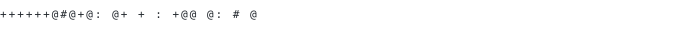

# Mokshith

> Software developer building clean, scalable systems.

<!-- TODO: swap these for your real links, or delete the row if some don't apply -->
[website](https://example.com) · [instagram](https://www.instagram.com/mokshithkulal_) · [linkedin](https://www.linkedin.com/in/mokshith-mokshith-7126a8343) · [email](mailto:mokshithkulal78@gmail.com.com)

<!-- TODO: replace with your real 2-3 line bio -->
Student working across data science and web development, with a soft spot
for clean, scalable systems and cinematic front-end builds. Comfortable
moving between notebooks and production code.

<samp>python</samp> · <samp>django</samp> · <samp>javascript</samp> · <samp>docker</samp> · <samp>postgres</samp> · <samp>git</samp>

<!-- TODO: replace these three with your real repos — name, one tag line, 1-2 sentence description -->
**[project-one](https://github.com/mokshith/project-one)** · `python, django`
One-line description of what it does and why it's interesting.

**[project-two](https://github.com/mokshith/project-two)** · `javascript, react`
One-line description of what it does and why it's interesting.

**[project-three](https://github.com/mokshith/project-three)** · `docker, postgres`
One-line description of what it does and why it's interesting.

 
 

Every graphic on this profile is self-generated inside this repository.
`ascii.svg` is an animated typing ASCII portrait rendered from an embedded
font subset. The section headings above are SVGs for the same reason —
GitHub strips `<style>` from READMEs, so an image is the only way to give
this page's own typeface to anything but the portrait. Daily stats are
drawn natively via the GitHub GraphQL API through a scheduled GitHub
Action, committing only what changed. Everything animates with SMIL
inside the SVG itself, since GitHub also strips scripts — and since
nothing loads from a third party, nothing here can rate-limit or go dark.